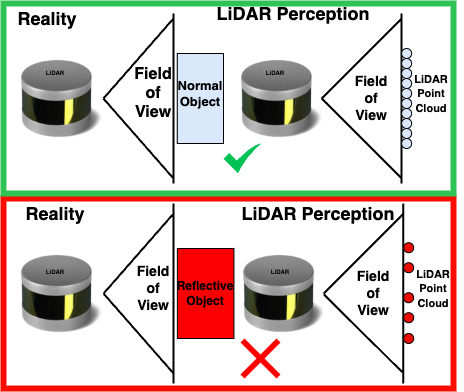

# ReAL: Machine Learning Detection of Reflective Attacks against Lidarometry (Accepted in IEEE SoutheastCon 2025)

[](LICENSE)
[](https://www.python.org/)

**Authors**: Abhijeet Solanki<sup>1</sup>, Luke Beirne<sup>2</sup>, Syed Rafay Hasan<sup>3</sup>, Wesam Alamiri<sup>3</sup>  
<sup>1</sup>Department of Electrical and Computer Engineering, Tennessee Technological University  
<sup>2</sup>Department of Computing Sciences, Coastal Carolina University

---

## Overview
This repository contains code for the paper **ReAL**, focusing on detecting reflective surface interference in LiDAR readings. Our approach employs a machine learning-based system for real-time detection of reflective interference on resource-constrained devices.

<p align='center'>
  
</p>


## Table of Contents
- [Installation](#installation)
- [Usage](#usage)
- [Scenarios](#scenarios)
- [Dataset](#dataset)
- [Result](#result)
- [References](#references)

---

## Installation

```bash
# Clone the repository
git clone https://github.com/ChiefAj23/ReAL-ReflectiveAttack-Detection-Lidar.git
cd ReAL-ReflectiveAttack-Detection-Lidar
```
```bash
# Install dependencies
pip install -r requirements.txt
```
## Requirements
Python 3.7+
Jetson Orion Nano (for resource-constrained testing)
LiDAR sensor (RPLiDAR A1M8-R6 recommended)
Make sure to set up the hardware and sensor according to the manufacturer’s guidelines.

##Usage
To begin detecting reflective attacks on LiDAR data:

Set up the LiDAR sensor and prepare your testing environment using requirement.txt
Run the detection command with preprocessed LiDAR data:
```bash
python detect_reflective_attack.py --input data/lidar_data.csv --model checkpoints/svm_model.pkl
```
This command initiates real-time interference detection using the specified model and input dataset.

## Scenarios
Scenario 1: Four objects were placed 15 mm from the LiDAR at a 0° angle, scanned 25,000 times under normal and reflective surface conditions, totaling 200,000 scans. This scenario establishes a baseline for how reflections affect LiDAR measurements at a fixed distance and angle.

Scenario 2: A single object was positioned at five different angles (52°–317°) and distances (16.6–29.6 cm). Each position underwent 50,000 scans (normal and reflective), resulting in 250,000 scans. This scenario examines how angle and positioning impact reflective interference.

Scenario 3: Two objects were placed at 0° and 90°, and tested in four covered/uncovered combinations (N/N, N/S, S/N, S/S), each scanned 25,000 times. Object positions were swapped and repeated across two object sets, leading to 400,000 scans. This scenario simulates real-world conditions with multiple reflective surfaces.

## Dataset
We used RpLidar to collect and gather data can be found in the folder Data.

## Result
Our Trained model performed better and below are the inference results we achieved in detecting reflective attacks using the Jetson Orin device.
### Inference Performance of the Defense Model on Jetson Orion
| Scenario   | Inference Accuracy (%) | F1-Score | Latency (ms) |
|------------|------------------------|----------|--------------|
| Scenario 1 | 92.71                   | 92.70    | 2.763        |
| Scenario 2 | 95.53                   | 95.52    | 4.727        |
| Scenario 3 | 99.97                   | 99.97    | 0.083        |

## Q&A
Questions are welcome via asolanki42@tntech.edu


## License
This project is licensed under the MIT License - see the LICENSE file for details.


