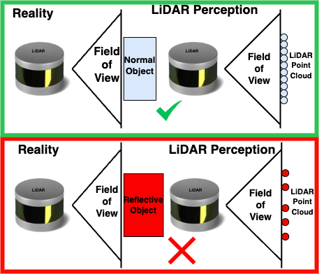

# ReAL: Machine Learning Detection of Reflective Attacks against Lidarometry (Published in IEEE SoutheastCon 2025) (Presented in SoutheastCon 2025 Conference by Abhijeet Solanki)

[](LICENSE)
[](https://www.python.org/)
[](https://doi.org/10.1109/SoutheastCon56624.2025.10971487)

**Authors**: Abhijeet Solanki<sup>1</sup>, Luke Beirne<sup>2</sup>, Syed Rafay Hasan<sup>3</sup>, Wesam Alamiri<sup>4</sup>  
<sup>1,3,4</sup>Department of Electrical and Computer Engineering, Tennessee Technological University  
<sup>2</sup>Department of Computing Sciences, Coastal Carolina University

---

## Overview
This repository contains code for the paper **ReAL**, focusing on detecting reflective surface interference in LiDAR readings. Our approach employs a machine learning-based system for real-time detection of reflective interference on resource-constrained devices.

<p align='center'>
  
</p>


## Table of Contents
- [Installation](#installation)
- [Usage](#usage)
- [Scenarios](#scenarios)
- [Dataset](#dataset)
- [Result](#result)
- [References](#references)

---

## Installation

```bash
# Clone the repository
git clone https://github.com/ChiefAj23/ReAL-ReflectiveAttack-Detection-Lidar.git
cd ReAL-ReflectiveAttack-Detection-Lidar
```
```bash
# Install dependencies
pip install -r requirements.txt
```
## Requirements
- Python 3.10+ (the pinned NumPy 2.2 needs it)
- Jetson Orin Nano (for resource-constrained testing)
- LiDAR sensor (RPLiDAR A1M8-R6 recommended)

Set up the hardware and sensor according to the manufacturer’s guidelines.

## Usage
Each experiment has its scripts in `Code/Experiment-N` and its scans in `Data/Experiment-N(Scenario-N)`. The training scripts read the CSV files by name, so run them from the matching data folder. For Scenario 1:

```bash
cd "Data/Experiment-1(Scenario-1)"
python ../../Code/Experiment-1/Ex1_Final.py
```

This trains the RBF-kernel SVM (gamma 100), saves the model next to the data, and prints accuracy, F1 and inference latency for the test split and the held-out inference scans (also written to `svm_ex1_gamma_results.csv`). Trained models are also included in `Pre-Trained Model/`. Some inference scripts load their model and data from absolute paths set at the top of the file; point those at your copies before running them.

## Scenarios
Scenario 1: Four objects were placed 15 mm from the LiDAR at a 0° angle, scanned 25,000 times under normal and reflective surface conditions, totaling 200,000 scans. This scenario establishes a baseline for how reflections affect LiDAR measurements at a fixed distance and angle.

Scenario 2: A single object was positioned at five different angles (52°–317°) and distances (16.6–29.6 cm). Each position underwent 50,000 scans (normal and reflective), resulting in 250,000 scans. This scenario examines how angle and positioning impact reflective interference.

Scenario 3: Two objects were placed at 0° and 90°, and tested in four covered/uncovered combinations (N/N, N/S, S/N, S/S), each scanned 25,000 times. Object positions were swapped and repeated across two object sets, leading to 400,000 scans. This scenario simulates real-world conditions with multiple reflective surfaces.

## Dataset
The RPLiDAR scans for every scenario are in the `Data` folder, one subfolder per experiment.

## Result
Inference results for detecting reflective attacks on the Jetson Orin:
### Inference Performance of the Defense Model on Jetson Orin
| Scenario   | Inference Accuracy (%) | F1-Score | Latency (ms) |
|------------|------------------------|----------|--------------|
| Scenario 1 | 92.71                   | 92.70    | 2.763        |
| Scenario 2 | 95.53                   | 95.52    | 4.727        |
| Scenario 3 | 99.97                   | 99.97    | 0.083        |

## Q&A
Questions are welcome via asolanki42@tntech.edu,lpbeirne@coastal.edu, and walamiri@tntech.edu

## Acknowledgement
This research is partially supported by the Tennessee Tech
University’s Center for Manufacturing Research, National Science Foundation Grant (NSF-REU 2349104)


## References
A. Solanki, L. Beirne, S. R. Hasan and W. Alamiri, "ReAL: Machine Learning Detection of Reflective Attacks against Lidarometry," *IEEE SoutheastCon 2025*. [doi:10.1109/SoutheastCon56624.2025.10971487](https://doi.org/10.1109/SoutheastCon56624.2025.10971487)

## License
This project is licensed under the MIT License - see the LICENSE file for details.


